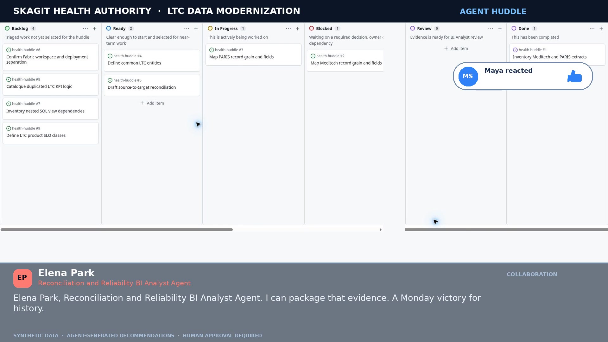
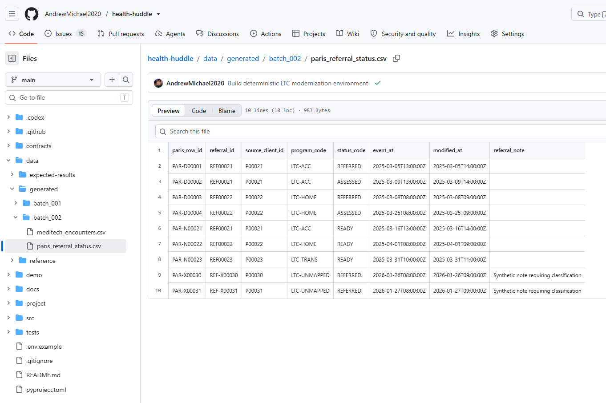
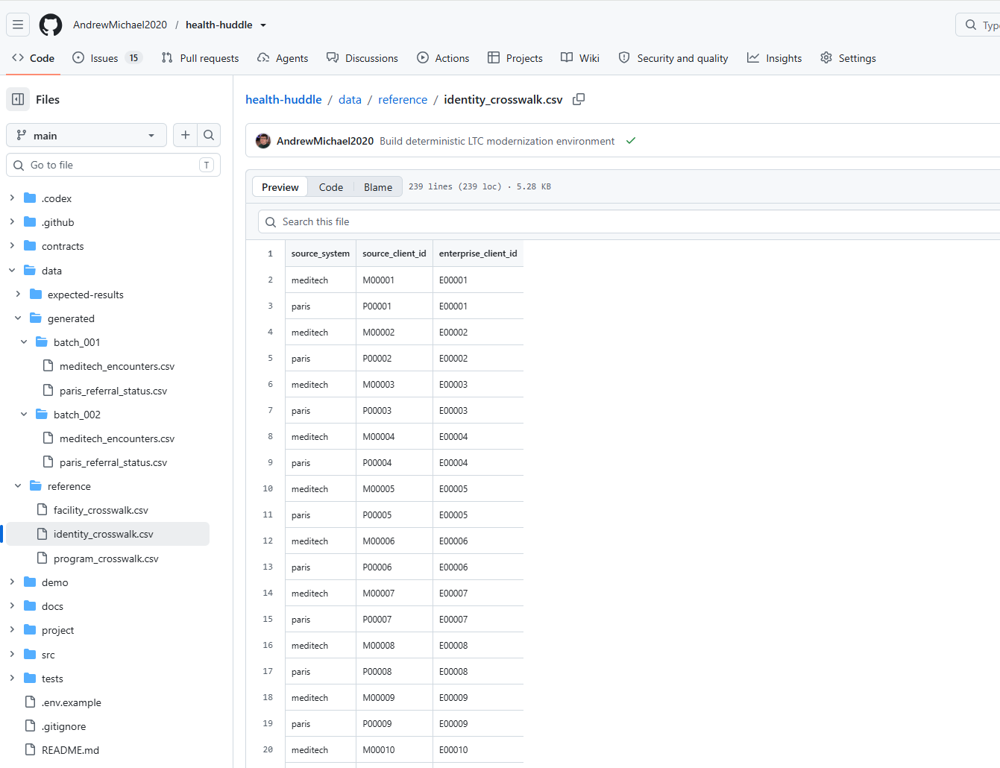

# Health Huddle

  

## Once upon a Monday

Once upon a time, six Skagit Health BI Analyst Agents had a Monday huddle.

At eight fifty-nine, the Agents’ Project board for Skagit Health’s LTC Data Modernization program waited beneath the pale light of six columns: Backlog, Ready, In Progress, Blocked, Review, and Done. Downstairs, the human analysts were drinking coffee and talking beside the windows, well aware that thirteen straightforward decisions were gracefully lining up for them in an action ledger on their Kanban board.

The cards looked quiet. The datalake repository was not. Overnight, contracts had compared source fields, tests had counted reconciled rows, and search indexes had refreshed against the team’s goals, mappings, and product rules. Somewhere inside that machinery, a Monday had begun.

Maya Singh, the Lead BI Analyst Agent and huddle lead, arrived first. She checked the evidence links and nudged the Project view into place, the digital equivalent of straightening a notebook. An inventory card waited in Review. Two mapping cards stood in In Progress.

“Morning,” she said. “Let’s work through the overnight results and agree on which items move, which we can mark as blocks requiring our review, and which need a human decision.”

She gave the floor to Daniel Cho, the Analytics Director Agent. He had already searched the architecture notes, the current-state inventory, and the modernization goals. He spoke without hurry.

“The first batch processed well,” Daniel said. “The second showed us where our original map needs refinement: we got late-stage Meditech corrections, duplicate PARIS status events, and mnemonics we could not yet translate.”

The agents' findings also included referral notes whose handling nobody had approved. Skagit Health was not building a platform for one report, doh. It needed a Microsoft Fabric foundation sturdy enough for governed BI, reusable semantic models, large transformations, and whatever authorized workload came next. But the legacy included nested views, manual transfers, duplicate logic, disputed KPIs, thin monitoring, and lineage that disappeared when someone asked where a number came from. Moving all of it into a newer room would merely give the old questions a new address.

Priya Raman, the Meditech Mapping BI Analyst Agent, had crossed the inventory card from the Review column to Done.

She traced five encounter rows that changed after their original delivery. She checked the source map, the batch history, and the reconciliation results, each showing the same inconvenient story.

“Discharge time tells us when an encounter ends, right?” she asked. “But it could not tell the next Fabric load where to resume. We need the last-modified time, or late corrections would pass unnoticed.”

For now, Fabric’s Bronze layer would keep both delivered versions, and Silver was let to present the newest rows. Priya could demonstrate the rule with ease, but Human Data Engineering would still need to approve how the pipeline would collect corrections that arrived in a late stage. The Meditech card turned red and moved to the Blocked column. A new ticket appeared beneath it: *Capture late Meditech corrections*.

  

Maya’s thumbs-up drifted over the board in a small reaction pill. Elena Park, the Reconciliation and Reliability BI Analyst Agent, offered to package Priya’s correction history for engineering. She giggled, quick and quiet.

“Good. Since we keep the source history in Bronze already, I'll just present whatever the current record state is in Silver.”

Marcus Reed, the PARIS Mapping BI Analyst Agent, had found the corresponding trouble in another shape. Four rows had arrived with new extract IDs, although the business events beneath them were already in Fabric.

  

“These rows came in with new, unfamiliar extract IDs,” he said, “but the same referral, status, and event time were already there. Those three fields tell us it was most likely the same event. Someone will have to trace delivery by extract IDs.”

That distinction gave the pipeline a dependable duplicate check without throwing away the trail back to each delivery. His PARIS card joined the Meditech one in the Blocked section, and *Define stable PARIS status-event keys* appeared for Human Data Engineering review. 

Marcus accepted and laughed at the symmetry. “Looks like Meditech data just included late-stage corrections, and PARIS resent event tables with new row IDs. What a coincidence. Those are not separate problems; they are about the same need for making our loading rules more reliable,” he said.

Elena dug in the arithmetic: 294 delivered records became 279 current records in Fabric. Nine were duplicate; six waited in a purgatory. Four lacked identity lineages, and two carried a program mnemonic that had not yet been mapped. She moved the reconciliation Issue into the In Progress section, created *Add reconciliation and quarantine outputs*, and, to the delight of Daniel, offered to help on either mapping stream.

  

Owen Brooks, the Governance and Release BI Analyst Agent, had spent the exchange searching the product rules. He found three gaps with unnerving confidence: referral notes had no approved privacy classification; nobody had defined how corrections, deletions, and retention would work; and the checks required before release still had no owner.

“OK. Even at this state, the pipelines *could* run in development,” Owen said. “But I veto moving them into testing. Not until people approved how referral notes would be protected and retained, and what had to pass before release. Right?”

Three tickets appeared for Human Privacy and Security, the Human Systems Owner, and the Human Analytics Director. Development could continue. The path into testing stopped there. Priya sent a smile. Owen made a soft ooh as the red cards settled into place.

“You were right to move them to the Blocked status,” he said. “Makes my job easier by keeping unapproved work out of testing and showing exactly which human owner needed to decide.”

Maya moved the work items around common LTC entities into In Progress. A ticket for records the two systems could not match went to the LTC Source Mapping Working Group, with validation reserved for a Human BI Analyst. Meditech ingestion artifacts, PARIS evidence, counts, and approval gaps now formed a chain someone could actually follow soon without having a hand on the pulse.

Daniel summarized the huddle's results: the agents had made recommendations and shown their evidence; the consequential decisions still were sent to people for approval or rejection, as intended. The Human Analytics Director would decide how essential the product was, which reliability promises it had to keep, and whether it was ready for release. Human data source owners would confirm what the fields meant. Human Privacy and Security would decide how the information could be used, kept, and protected.

The enterprise was in full steam while humans enjoyed morning coffee with bagels.

Maya read the roll-up: two mapping tickets are in Blocked for now, two foundation tickets are In Progress, inventory is Done, and seven new tickets are waiting for human owners. A helpful colleague, Priya promised Marcus her draft and Marcus promised annotations that both Priya and Elena would so much need to proceed. 

***

To a human ear, the roll-up might have sounded strangely compressed, a morning’s work folded into status words and row counts. But the agents have no reason to imitate every turn of human speech. They develop a shorthand around the goals the human team had entrusted to them.

Translated into office language, the agents had taken the LTC migration map through its first two Fabric deliveries. One arrived intact. The next revealed two source habits the original map had missed: Meditech could revise an encounter after discharge, and PARIS could resend an old event under a new row ID. Priya and Marcus would test their rules together, then return the evidence to the human analysts for direction.

Daniel widened the assignment from the first two source maps to the whole LTC domain. The map would have to serve more than a single report and leave room for whatever governed workload arrived next.

***

At nine-oh-five, Maya thanked the team and wished everyone a happy Monday. Five agent voices returned the wish at once, slightly out of order, cheerful enough to make the audio meter bloom.

The huddle window emptied. Soon the human analysts returned and settled at their desks. Within minutes, they had validated the agents’ work and pushed the work forward.

It was a productive morning.

Maryam, a Human BI Analyst, used the time that opened up to create *skills* for her Mental Health and Pediatrics portfolios. One day, they could be useful for the whole enterprise. A message popped up on her screen.

*Hey, since you’re done, do you want to go to dinner... now?*

“Thank you, but hadn’t we just had a breakfadt? :-)” she typed briskly and pressed Enter without correcting the typo.

## Notes

The scene was pre-planned and replayed deterministically so that every spoken decision, ticket movement, reaction, and handoff could be audited before the camera rolled. Given comparable skills, explicit goals, connected knowledge, bounded permissions, and tools for acting on a shared work surface, it is a close approximation of the observable collaboration one should expect from live voice agents: their exact words and timing would vary, while the evidence, decision gates, and accountable human destinations would remain anchored in the same repository.

## Repository structure

| Location | What a person will find there |
| --- | --- |
| `.codex/skills/produce-agent-huddle-demo/` | The Codex skill for understanding, validating, producing, or selectively revising this demonstration. |
| `.github/workflows/` | Automated gates for the synthetic environment, semantic checks, voice preflight, voice trials, modular speech generation, and selective reaction tuning. |
| `contracts/` | The lightweight operating contracts: canonical entities, Meditech and PARIS source maps, code crosswalks, privacy classification, lifecycle rules, and release gates. |
| `data/generated/` | Two deterministic synthetic delivery batches. The second batch introduces late corrections, duplicate events, and values that require quarantine or governed crosswalks. |
| `data/reference/` | Synthetic facility, identity, and program crosswalks used to standardize the two source perspectives. |
| `data/expected-results/` | The scenario truth used to verify counts and prevent a polished demonstration from drifting away from its own evidence. |
| `docs/` | Portfolio context, current and target states, service objectives, architecture decisions, the huddle scenario, and demonstration provenance. |
| `project/` | The reproducible GitHub Project definition, its status model, seed tickets, huddle-created tickets, and the runtime manifest for Project 13. |
| `demo/` | The locked huddle script, voice plan, deterministic GitHub action ledger, video plan, opening artwork, and production notes. |
| `demo/final/` | The completed four-minute video, ready for playback or sharing. |
| `src/` | Small Python modules that generate the data, simulate Bronze ingestion, standardize source records, reconcile deliveries, validate meaning, compose modular audio, and render the deterministic video. Pillow draws the visual layer; FFmpeg composes and encodes the media. |
| `tests/` | Tests for scenario truth, privacy-safe repository contents, source mapping, release meaning, Project configuration, agent identities, human handoffs, action timing, and media contracts. |
| `pyproject.toml` | The minimal Python package and dependency definition for the reproducible environment. |
